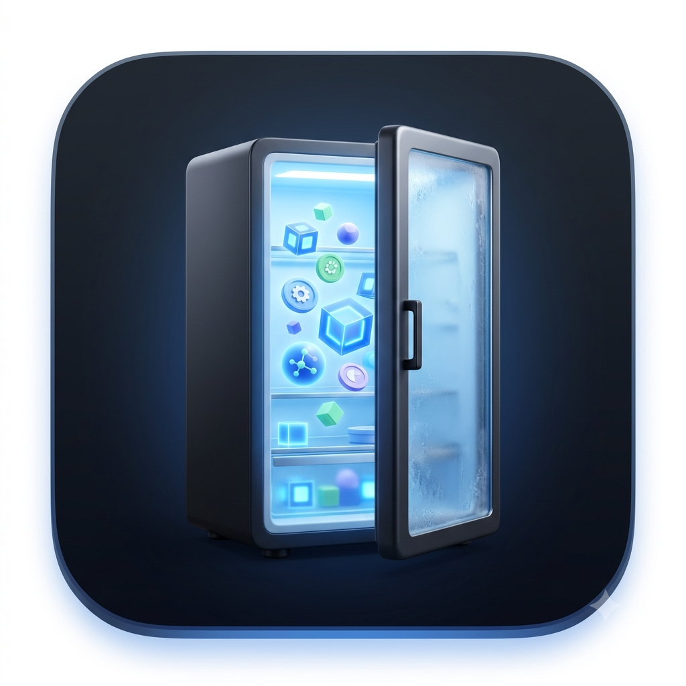

# 🧊 AI Refrigerator

<p align="center"></p>

**A CC Switch-style preset manager for AI coding agents.**

A local web app that collects Skills / Plugins / MCP servers / Agent repos / CLAUDE.md templates into a "Refrigerator (ingredient store)" and lets you combine them into purpose-built **Presets (recipes)** that you can save, load, apply, and export.

- **Zero** dependencies — uses only Node.js built-in modules
- The server binds to `127.0.0.1` only (no external exposure)
- Built-in AI recommendations powered by GitHub search + SkillsMP search + your own `claude` CLI

<!-- Screenshot: dashboard view (docs/screenshot-dashboard.png) -->
<!-- Screenshot: preset builder drag & drop view (docs/screenshot-builder.png) -->

## ⬇️ Download the app

Grab the latest build from **[Releases](https://github.com/leesangyeon1/AI-refrigerator/releases)** — no clone, no build step.

- **macOS** — `AI-Refrigerator-macOS-*.zip`. Unzip, drag **AI Refrigerator.app** to Applications, launch it from Spotlight or Launchpad like any other app. The whole app lives inside the bundle.
  The build is unsigned, so the very first launch needs **right-click → Open** (or `xattr -dr com.apple.quarantine "/Applications/AI Refrigerator.app"`).
- **Windows / Linux** — `AI-Refrigerator-source.zip`, then `node server.js --app`.

Node.js 18+ must be installed; the app says so if it isn't. Your presets and sessions live in `~/.ai-refrigerator/`, so replacing the app never touches them.

## ⚡ 30-Second Quickstart (from source)

```bash
git clone https://github.com/leesangyeon1/AI-refrigerator.git
cd AI-refrigerator
node server.js
```

That's it. On macOS the browser opens automatically (default address `http://127.0.0.1:4924`).
To disable auto-open, use `node server.js --no-open`; to change the port, use `--port 5000` or `PORT=5000`.

### 🖥️ Run as a desktop app (like cc-switch)

Two ways to launch it as a standalone app window (no browser tabs/address bar):

```bash
npm run app          # or: node server.js --app  → opens a Chrome/Edge --app window
```

Or double-click one of these in Finder (macOS):

- **`AI Refrigerator.app`** — a real app bundle; launch it from Finder / Spotlight / Launchpad.
- **`AI-Refrigerator.command`** — a double-clickable launcher script.

Both start the local server (if not already running) and open a dedicated app window. Requires a Chromium-family browser (Chrome, Edge, Brave, Vivaldi); otherwise it falls back to your default browser.

### 📦 Build the downloadable app yourself

```bash
npm run build:app    # → dist/AI Refrigerator.app + dist/AI-Refrigerator-macOS-<version>.zip
```

The bundle carries its own copy of the server and assets, so it runs from `/Applications` with the repo deleted. Pushing a `v*` tag runs the same script in CI and attaches the zip to a GitHub Release.

## ✨ Key Features

1. **📊 Dashboard Quick Switch** — Lists presets as cards so you can copy a session command or apply globally with a single click. The most recently applied preset gets a `● Active` badge.
2. **🧊 Refrigerator (Catalog)** — ~200 built-in high-star ingredients + custom ingredients. Search by name/description/tags and filter by type (Skill/Plugin/MCP/Agent/CLAUDE.md/Tool/CLI).
3. **🍳 Preset Builder** — Combine ingredients into presets via drag & drop. Cards wrap onto new rows (no sideways scrolling). 1-second debounced auto-save, JSON import/export, and duplication.
4. **🔍 GitHub · SkillsMP · 🤖 AI Recommendations** — Marketplace-style discovery: sort GitHub results by **Stars / Forks / Updated** across **Day / Week / Month / All time**. AI recommendations auto-detect and use whichever AI CLI you have installed (Claude Code, Codex, Gemini, Cursor, Grok, OpenCode, Qwen) — pick one explicitly or let it auto-detect.
5. **🚀 3 Apply Modes** — 🎯 Session (changes nothing permanently) / 📁 Project (generates `.claude/settings.json`, `.mcp.json`, and `CLAUDE.md`, with dryRun preview and automatic backups) / 🌍 Global (enable/disable plugins, confirmation modal required).
6. **🧠 Skill Orchestrator** — In `Apply & Export`, run a preset through your AI CLI to get a context-optimization report: skill conflicts with severity (e.g. exhaustive docs vs. token minimalism), heavy skills routed to on-demand tools, and a 3-layer system prompt (persona · workflow · output filter) you can copy into a session.
7. **📦 Export** — Copy or download in 5 formats: `install.sh` / `settings.json` / `mcp.json` / `CLAUDE.md` / `preset.json`.

## 📋 Requirements

- **Node.js 18 or higher** (required — this is the only requirement)
- Optional: `claude` CLI — needed for Global apply mode and AI recommendations
- Optional: GitHub token — eases search rate limits (enter it in the Settings tab)

## 💾 Where your data lives (on-device)

Every user gets their own **private, on-device refrigerator**. All user data is stored under **`~/.ai-refrigerator/`** and is **never committed or pushed** — so `git pull`/`git push` updates the app without ever touching or overwriting your presets and sessions:

- `~/.ai-refrigerator/presets/` — your presets (recipes)
- `~/.ai-refrigerator/data/` — custom ingredients, saved sessions, settings, apply history
- `~/.ai-refrigerator/session-presets/` — generated session config files

What ships **in the repo** is only the read-only defaults used to **seed a fresh install**: the sample presets in `presets/` and the built-in catalog `data/catalog.json`. On first run they're copied into `~/.ai-refrigerator/`; after that, updating the app never changes your on-device data.

**Delete-proof.** Because your data lives outside the project folder, you can delete the whole repo, re-clone it later, and your presets/sessions/custom items are still there — the app detects the existing store (via `~/.ai-refrigerator/store.json`) and reuses it instead of reseeding. For extra safety, **Settings → Backup & Restore** exports your entire store as one file and restores it (e.g. onto another machine).

## 🔗 Sharing Preset JSON

1. **Export**: Use `Export JSON` from the column menu in the Preset Builder, or download the `preset.json` format from the `Apply & Export` tab.
2. **Send**: Share the file via Slack/Gist/PR, etc.
3. **Import**: The recipient selects it via `Import JSON` in the Preset Builder.

Six sample presets are included by default: 🎨 Frontend React · ⚙️ Backend API · 🪙 Token Saver · ☁️ Cloudflare Edge · 🔬 Research & Automation · 💬 Messaging Assistant.

## 🔒 Security Notes

- The server is **local-only** (bound to `127.0.0.1`, unreachable from outside).
- The GitHub token is stored only in `data/config.json`, which is **included in `.gitignore`** and never committed. It is also masked in API responses, showing only the last 4 characters.
- System-changing actions such as Global apply and running install.sh always go through a preview (dryRun) and confirmation step, and the generated install script is **never run automatically**.

## 📄 License

MIT — see [LICENSE](LICENSE).

For detailed usage, see [docs/USAGE.md](docs/USAGE.md).
